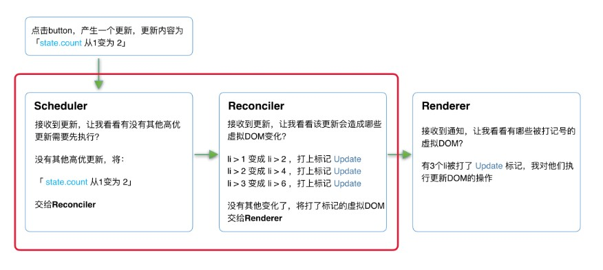

# React设计理念

>我们认为，React 是用 JavaScript 构建**快速响应**的大型 Web 应用程序的首选方式。它在 Facebook 和 Instagram 上表现优秀

**同步更新——>异步可中断的更新**
**rendering a React app is akin to calling a function whose body contains calls to other functions**
**旧的react使用递归的方式，可能会掉帧并且使动画不连贯**

[参考文章](https://github.com/acdlite/react-fiber-architecture)

## react架构

* scheduler(调度器)调度任务优先级
* Reconciler(协调器)找出变化的组件
* renderer 将变化的组件渲染到页面上

## schelduler

We can prioritize work coming from **user interactions** (such as an animation caused by a button click) over less important background work (such as rendering new content just loaded from the network) to avoid dropping frames

## reconciler

内部采用了fiber的数据结构

是核心组件
>This separation means that React DOM and React Native can use their own renderers while sharing the same reconciler, provided by React core.

* class 组件
* props，state
* effects，生命周期
* key,ref,context
* react.lazy,错误边界
* concurrent mode，suspense

>对比DOM树和fiber树，看哪些部分需要re-render

>React使用 key 这个属性来优化 reconciliation 过程。比如, key 属性可以用来检测 elements 数组中的子组件是否仅仅是更换了位置

#### fiber

>reactDOM=fiber
>fiber(纤程)，是协程的一种
>程序执行过程：协程，线程，进程；generator是js协程的实现
>A fiber represents a unit of work
>virtual stack frame

具体：**a fiber is a JavaScript object that contains information about a component, its input, and its output**

## renderer

* built-in组件(div，span...)

可以在别的环境中工作（plugin）

## 虚拟DOM

when you render a React application, a tree of nodes that **describes the app** is generated and saved in memory.This tree is then flushed to the rendering environment , it's translated to a set of **DOM operations**. When the app is updated (usually via setState), a new tree is generated. The new tree is **diffed with the previous** tree to compute which operations are needed to update the rendered app